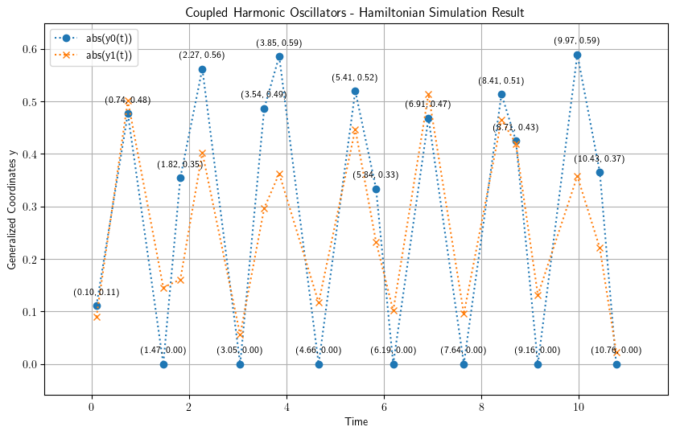
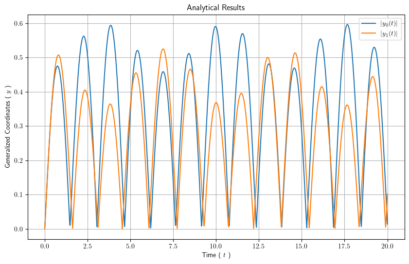

# Hamiltonian Simulation of $N=2$ Coupled Classical Oscillators

A quantum algorithm that delivers the dynamics of a 1-dimensional
system of $N$ coupled classical oscillators through Hamiltonian
simulation over time.


# Background

The dynamics of a 1-dimensional classical system of $N$ coupled
harmonic oscillators could be described in terms of _eigenfrequecies_
and _normal modes_.

To improve the time complexity of the required computations, a quantum
algorithm has been devised in [Exponential Quantum Speedup in
Simulating Coupled Classical
Oscillators](https://journals.aps.org/prx/abstract/10.1103/PhysRevX.13.041041). The
quantum algorithm relies on an amplitude encoding of the systems
dynamical variables in a normalized quantum state $| \psi(t) \rangle$. 
Consequently, finding a proper Hamiltonian, the behavior of the system
at time $\Delta t$ would be given by evolving $| \psi(t_0) \rangle$ to
$| \psi(t_0 + \Delta t) \rangle$.


# Implementation

Our strategy for Hamiltonian simulation would be to decompose the
Hamiltonian operator into Pauli terms of integral qubit size and to
evolve the decompsed Hamiltoninan using the generalized [_Suzuki-Trotter
decomposition_](https://arxiv.org/abs/math-ph/0506007v1).


# Software Requirements

To run the codes within the notebook, you would need the following
python modules:

```
pip install math matplotlib numpy sympy scipy enum classiq 
```
Apart from the above python modules, since we have used `r''`
formatting strings for the legends and labels of the plots, you need
to have a working LaTeX installation as well as the `cm-super`
package.


# Results

Our simulation results for $N=2$ with the physical parameters
$\{ m_0 = 1.0, m_1 = 2.0 \}$ , 
$k_{00} = 1.0$, 
$k_{01} = 2.0$, 
$k_{11} = 3.0$, 
and the initial condition
$\{ \dot{y}_0(0) = 1.0, \dot{y}_1(0) = -1.0, y_0(0) = 0.0, y_1(0) = 0.0 \}$ is as follows :



which compares quite well with the analytical results :




# Contributors

- Mohammadreza Khellat: [send email](mailto:mkhellat@gmail.com?subject=Regarding%20Coupled%20Harmonic%20Oscillators%20Simulation)
- Omid Abbasi: [send email](mailto:o.abbasi1982@gmail.com?subject=Regarding%20Coupled%20Harmonic%20Oscillators%20Simulation)


# GNU GPL v3+

Copyright (C) 2024 Mohammadreza Khellat GNU GPL v3+

This program is free software; you can redistribute it and/or modify
it under the terms of the GNU General Public License as published by
the Free Software Foundation; either version 3, or (at your option)
any later version.

This program is distributed in the hope that it will be useful, but
WITHOUT ANY WARRANTY; without even the implied warranty of
MERCHANTABILITY or FITNESS FOR A PARTICULAR PURPOSE.  See the GNU
General Public License for more details.

You should have received a copy of the GNU General Public License
along with this program; if not, write to the Free Software
Foundation, Inc., 59 Temple Place - Suite 330, Boston, MA 02111-1307,
USA.

See also https://www.gnu.org/licenses/gpl.html
