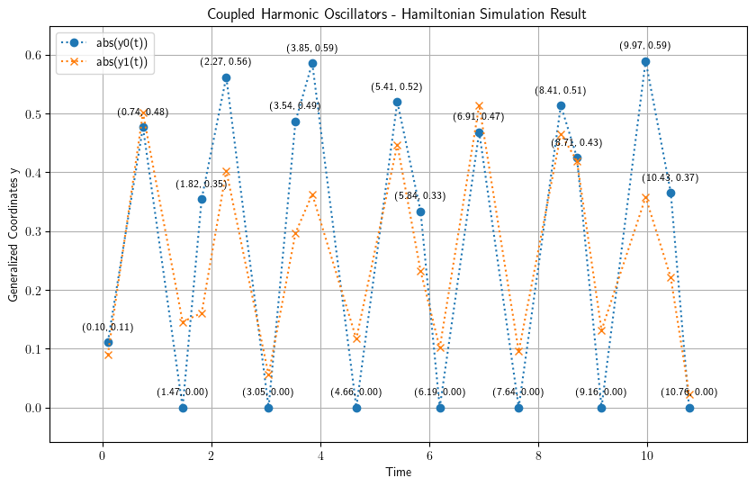
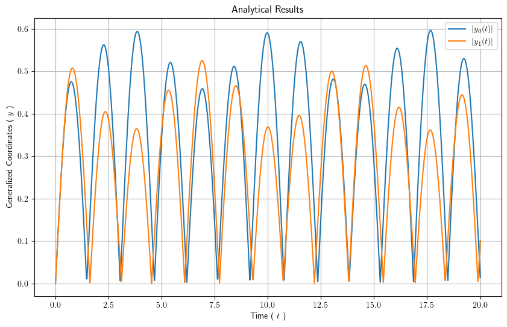

# Hamiltonian Simulation of $N=2$ Coupled Classical Oscillators

A quantum algorithm that delivers the dynamics of a 1-dimensional
system of $N$ coupled classical oscillators through Hamiltonian
simulation over time.

# Background

The dynamics of a 1-dimensional classical system of $N$ coupled
harmonic oscillators could be described in terms of _eigenfrequencies_
and _normal modes_.

To improve the time complexity of the required computations, a quantum
algorithm has been devised in [Exponential Quantum Speedup in
Simulating Coupled Classical
Oscillators](https://journals.aps.org/prx/abstract/10.1103/PhysRevX.13.041041)
([arXiv:2303.13012](https://arxiv.org/abs/2303.13012)). The quantum
algorithm relies on an amplitude encoding of the systems dynamical
variables in a normalized quantum state $| \psi(t) \rangle$. 
Consequently, finding a proper Hamiltonian, the behavior of the system
at time $\Delta t$ would be given by evolving $| \psi(t_0) \rangle$ to
$| \psi(t_0 + \Delta t) \rangle$.

**On the exponential speedup:** the cited paper's proven exponential
speedup applies specifically to computing a single *global* observable
(their example: one oscillator's kinetic energy at a given time) via
oracle query complexity - not to reconstructing the full trajectory
$y_i(t)$ for every oscillator $i$. This notebook's Hadamard-test driver
loop (used to recover the correctly signed trajectory, not just its
magnitude) does the latter: one circuit per basis state per time point,
linear in the number of oscillators, not exponentially cheaper than a
classical simulation of the same system. The exponential advantage is
real, but it belongs to a different task (a single collective readout)
than full-state reconstruction, which is what this notebook actually
demonstrates.

# Implementation

Our strategy for Hamiltonian simulation would be to decompose the
Hamiltonian operator into Pauli terms of integral qubit size and to
evolve the decomposed Hamiltonian using the generalized [_Suzuki-Trotter
decomposition_](https://arxiv.org/abs/math-ph/0506007v1). The number of
Trotter repetitions is derived from a rigorous, published error bound
(rather than an arbitrary fixed value) - see [_Theory of Trotter Error
with Commutator
Scaling_](https://arxiv.org/abs/1912.08854), Childs, Su, Tran, Wiebe,
Zhu, Phys. Rev. X 11, 011020 (2021), applied both as a general-purpose
2nd-order bound and, where the Hamiltonian's terms can be split into
three internally-commuting groups, a tighter 4th-order-specific bound
matching the order-4 formula this notebook actually uses.

Measuring the evolved state's amplitude only recovers its *magnitude*
$|\langle k|\psi(t)\rangle|$, losing sign and phase - so a magnitude-only
readout can only ever plot $|y_i(t)|$, not the true signed trajectory.
This notebook additionally implements a Hadamard-test circuit to recover
the full complex amplitude and reconstruct the correctly signed
$y_i(t)$, verified against both an independent statevector calculation
and a direct classical-ODE solution of the same physical system.

The notebook in this directory performs that Pauli decomposition
symbolically (SymPy), which is fine for small $N$ but does not scale
past roughly $N=4$ in practice. Scaling this to larger $N$ (target
$N=30$, stretch $N=100+$) is an active performance-engineering effort,
developed as a standalone installable package rather than inline
notebook code: see [`../../tools/paulikit`](../../tools/paulikit), which
implements a fast, original Pauli decomposition algorithm (Fast
Walsh-Hadamard Transform based, O(N² log N)) with its own correctness
tests, benchmarks, and command-line interface. See
[`../../tools/paulikit/PLAN.md`](../../tools/paulikit/PLAN.md) for the full
research background and phased plan.

# Software Requirements

The following Python packages are required to run this notebook:

- `numpy`
- `scipy`
- `sympy`
- `matplotlib`
- `classiq`

**Note:** The `math` and `enum` modules are part of Python's standard
library and do not require installation. All other packages listed above
are included in the top-level `requirements.txt`. If you have set up the
base environment as described in the main README, no additional
installation is needed.

Apart from the above Python modules, since we have used `r''` formatting
strings for the legends and labels of the plots, you need to have a
working LaTeX installation as well as the `cm-super` package.

# Results

Our simulation results for $N=2$ with the physical parameters
$\{ m_0 = 1.0, m_1 = 2.0 \}$ , 
$k_{00} = 1.0$, 
$k_{01} = 2.0$, 
$k_{11} = 3.0$, 
and the initial condition
$\{ \dot{y}_0(0) = 1.0, \dot{y}_1(0) = -1.0, y_0(0) = 0.0, y_1(0) = 0.0 \}$ is as follows :

which compares quite well with the analytical results :

The plot above uses the notebook's original, magnitude-only readout
($|y_i(t)|$ - sign and phase are lost by measurement alone). The
notebook also implements a Hadamard-test-based readout that recovers
the correctly **signed** trajectory (see "Implementation" above and
Section 7 of the notebook), which shows real sign oscillation instead
of only positive cusps at each zero-crossing.

## Reproducing Results

To reproduce these figures, run the notebook
`N_coupled_harmonic_oscillators_1_D_N_2.ipynb` end to end (Section
numbers below refer to the notebook's own numbered headings, not fixed
cell indices, which shift as the notebook is edited):

- **Section 7.2** ("Signed simulation results"): generates the signed
  trajectory plot via the Hadamard-test driver loop (checkpointed to
  `hadamard_test_checkpoint.json` - safe to interrupt and resume; the
  full sweep takes on the order of 30-45 minutes due to the number of
  Classiq cloud synthesize/execute round-trips required)
- **Section 7.3** ("Magnitude-Only Simulation Results"): generates the
  original magnitude-only plot (`hs_n_2.png`), checkpointed to
  `magnitude_loop_checkpoint.json`
- **Section 7.4-7.5** ("Analytical Solution", "Analytical Solution
  Plot"): generates the analytical solution plot (`ar_n_2.png`)

By default, the plots are displayed using `plt.show()`. To save them to
the `figures/` directory, add `plt.savefig('figures/filename.png')` calls
before `plt.show()` in the respective cells.

**Note:** The figures in the `figures/` directory are precomputed examples
for reference. Running the notebook will generate new plots based on the
current execution results. All Classiq circuit execution in this
notebook runs on Classiq's **simulator** backend only - no real quantum
hardware is used anywhere.

# Contributors

- Mohammadreza Khellat: [send email](mailto:mkhellat@gmail.com?subject=Regarding%20Coupled%20Harmonic%20Oscillators%20Simulation)
- Omid Abbasi: [send email](mailto:o.abbasi1982@gmail.com?subject=Regarding%20Coupled%20Harmonic%20Oscillators%20Simulation)

# GNU GPL v3+

Copyright (C) 2024 Mohammadreza Khellat GNU GPL v3+

This program is free software; you can redistribute it and/or modify
it under the terms of the GNU General Public License as published by
the Free Software Foundation; either version 3, or (at your option)
any later version.

This program is distributed in the hope that it will be useful, but
WITHOUT ANY WARRANTY; without even the implied warranty of
MERCHANTABILITY or FITNESS FOR A PARTICULAR PURPOSE.  See the GNU
General Public License for more details.

You should have received a copy of the GNU General Public License
along with this program; if not, write to the Free Software
Foundation, Inc., 59 Temple Place - Suite 330, Boston, MA 02111-1307,
USA.

See also https://www.gnu.org/licenses/gpl.html
